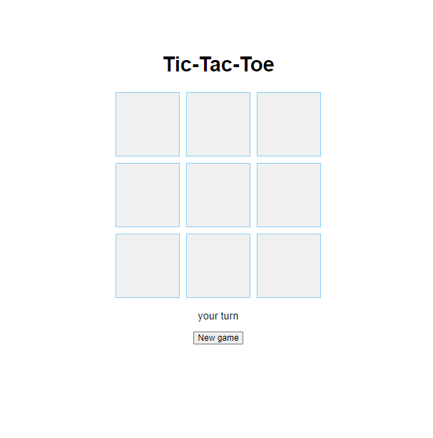

# Tic-Tac-Toe Sample

## Table of contents

- [Overview](#overview)
  - [Screenshot](#screenshot)
  - [Links](#links)
- [My process](#my-process)
  - [Built with](#built-with)
  - [What I learned](#what-i-learned)
  - [Useful resources](#useful-resources)
- [Author](#author)

## Overview

### Description

This is a web-based version of the classic game of tic-tac-toe. The game allows a single player to play against the computer.

### Features

The game board is a 3x3 grid, with each square represented by a button.
The player moves first and marks their squares with an "X" symbol.
The computer moves second and marks its squares with an "O" symbol.
The game ends when either the player or the computer wins, or when all squares are filled without a winner.
The game includes a "New Game" button to start a new game.
The game displays the current turn, whether it's the player's turn or the computer's turn.

### Screenshot

### Links

- Solution URL: [Tic-Tac-Toe](https://github.com/lashasuxa/tic-tac-toe-sample)
- Live Site URL: [Tic-Tac-Toe](https://lashasuxa.github.io/tic-tac-toe-sample/)

## My process

### Built with

- Semantic HTML5 markup
- CSS custom properties
- Flexbox
- CSS Grid
- JS

### What I learned

Basic HTML CSS
JS Basics
Dom manipulations
querySelector
addEventListener
classList
setTimeout
clearTimeout

### Useful resources

https://developer.mozilla.org/en-US/docs/Web/API/Document/querySelector \
https://developer.mozilla.org/en-US/docs/Web/API/Element/classList \
https://developer.mozilla.org/en-US/docs/Web/API/setTimeout

## Author

- Linkedin - [Lasha Sukhashvili](https://www.linkedin.com/in/lasha-sukhashvili-337034150/)
- Github - [lashasuxa](https://github.com/lashasuxa)
